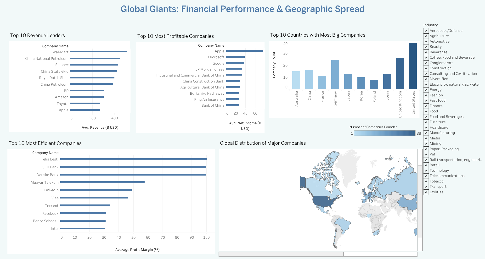

# Global Giants: Financial Performance & Geographic Spread

View the Interactive Tableau Dashboard  
*https://public.tableau.com/views/Book2_17514148188200/Dashboard4?:language=en-US&publish=yes&:sid=&:redirect=auth&:display_count=n&:origin=viz_share_link*

This project analyzes a dataset of major global companies to uncover insights into revenue, profitability, efficiency, and global distribution. The goal is to explore how top companies perform across various dimensions and where they are geographically concentrated.

## Dashboard Features

- **Top 10 Revenue Leaders** (3-year average)
- **Top 10 Most Profitable Companies** (average net income)
- **Top 10 Most Efficient Companies** (average profit margin)
- **Top 10 Countries with the Most Big Companies**
- **Map of Global Company Distribution**
- **Industry Filter** (interactive control to explore all visuals by sector)

---

## Business Questions Answered

- Which companies generate the most revenue?
- Which firms are the most profitable and efficient?
- Which countries are home to the highest number of major companies?
- How are industries distributed across regions?
- Which company had the strongest revenue growth?

---

## Key Insights

- **Apple** leads in both **revenue** and **net income**, the only company appearing in both top-10 lists.
- **Alibaba** (Retail sector) shows the **highest revenue growth**, reaching **+75.94%**, based on our 3-year growth formula.
- The **United States** is home to the most global giants (**38 companies**) and dominates across sectors like **Retail**, **Media**, and **Beverages**.
- The **United Kingdom** comes second in company count and has strong representation across multiple industries.
- **Profit efficiency** (profit margin) is led by companies like **Telia Eesti**, **Danske Bank**, and **SEB Bank**, all exceeding 90% average margins.
- Despite high revenue, some companies (e.g., Sinopec, BP) show relatively lower margins, highlighting operational inefficiencies.
- The map highlights a dense concentration in **North America and Western Europe**, with sparse representation in **Africa and South America**.
- **Bombardier Inc.** and **PandaDoc** are operating with negative average profit margins. This could reflect high operating costs, restructuring, or heavy investments. On the other end, **Apple** shows an unusually high average margin of 100.6%, which suggests an artifact in the data

---

## Recommendations

- **Double down on high-margin firms** for case studies or investment strategies.
- **Monitor industry leadership shifts**, especially in Finance, Technology, and Retail sectors.
- Use this dashboard to **support strategic market entry decisions**, industry benchmarking, or academic research.

---

## File Contents

- `big_companies.sql`: SQL queries to calculate averages, margins, and rankings.
- `dashboard.png`: Screenshot of the Tableau dashboard.

---

## Tools Used

- **Excel**: Initial data cleaning, validation, and formatting.
- **MySQL**: Calculations of KPIs like average margin, revenue, and growth.
- **Tableau Public**: Visualization and interactive dashboard creation.

---

## Data Source
 
*(https://www.kaggle.com/datasets/marshuu/worlds-biggest-companies-dataset?select=cleaned_biggest_companies.csv)*

---

> Created as part of a hands-on data analytics project. For feedback or questions, feel free to connect!
